# FTH Core - Enhanced Gold-Backed Token System

## 🏗 Architecture Overview

FTH Core is a comprehensive gold-backed token ecosystem featuring multiple smart contracts working together to provide a secure, transparent, and decentralized gold tokenization platform.

### Core Components


## 📊 Token Lifecycle Flow


## 🏛 Governance Flow


## 🥇 Staking Mechanism

```mermaid
graph LR
    subgraph "Staking Process"
        A[User Stakes FTHC] --> B[Lock Period Starts]
        B --> C[Earn Rewards]
        C --> D[Claim Rewards]
        D --> C
        C --> E[Unstake After Lock]
        E --> F[Receive FTHC + Rewards]
    end
    
    subgraph "Reward Calculation"
        G[Staked Amount] --> H[× APY Rate]
        H --> I[× Time Staked]
        I --> J[÷ Seconds Per Year]
        J --> K[= Reward Amount]
    end
```



## 🔒 Security Architecture


## 🌐 Oracle System


## 🛡 Multi-Signature Operations


## 📈 Token Economics

### Backing Mechanism
- **1:1 Gold Backing**: Each FTHC token represents 1 gram of physical gold
- **Full Reserves**: Cannot mint tokens without sufficient gold backing
- **Transparent Tracking**: All gold deposits/withdrawals recorded on-chain

### Supply Mechanics
- **Maximum Supply**: 1 billion FTHC tokens
- **Minting**: Only possible with sufficient gold reserves
- **Burning**: Available to any token holder at any time

### Price Discovery
- **Oracle-Fed Pricing**: Real-time gold price updates from multiple sources
- **USD Valuation**: Each token's USD value matches gold price per gram
- **Market Trading**: Tokens can trade on secondary markets

## 🔧 Technical Specifications

### Smart Contract Details

#### FTHCore Contract
- **Token Standard**: ERC20 with extensions
- **Security Features**: Pausable, ReentrancyGuard, Access Control
- **Gas Optimization**: Efficient storage patterns
- **Event Logging**: Comprehensive event emissions

#### FTHGovernance Contract
- **Voting Period**: 7 days
- **Proposal Threshold**: 100,000 FTHC tokens
- **Quorum Requirement**: 10% of total supply
- **Execution Delay**: 2 days after successful vote

#### FTHStaking Contract
- **Minimum Stake**: 1,000 FTHC tokens
- **Lock Period**: 30 days
- **Default APY**: 5% (configurable)
- **Reward Distribution**: Continuous, claimable anytime

#### FTHOracle Contract
- **Minimum Oracles**: 3 active oracles required
- **Price Validation**: ±5% deviation check
- **Update Threshold**: 75% oracle weight consensus
- **Data Freshness**: 1-hour maximum age

### Gas Costs (Optimized)

| Operation | Gas Cost | Description |
|-----------|----------|-------------|
| Deposit Gold | ~45,000 | Including events and security checks |
| Mint Tokens | ~110,000 | Including backing verification |
| Burn Tokens | ~105,000 | Including event emissions |
| Withdraw Gold | ~105,000 | Including backing ratio checks |
| Stake Tokens | ~120,000 | Including reward calculations |
| Vote on Proposal | ~95,000 | Including weight calculations |
| Oracle Price Update | ~85,000 | Including aggregation logic |

## 🚀 Deployment Guide

### Prerequisites
- Foundry development framework
- Ethereum node access (Infura/Alchemy)
- Sufficient ETH for deployment gas costs

### Deployment Steps

1. **Deploy Core Contracts**
```bash
forge script script/Deploy.s.sol --rpc-url $RPC_URL --broadcast
```

2. **Initialize Oracle System**
```solidity
oracle.addOracle(oracle1Address, 3000); // 30% weight
oracle.addOracle(oracle2Address, 2500); // 25% weight
oracle.addOracle(oracle3Address, 2500); // 25% weight
oracle.addOracle(oracle4Address, 2000); // 20% weight
```

3. **Set Up Multi-Sig**
```solidity
address[] memory owners = [owner1, owner2, owner3];
FTHMultiSig multiSig = new FTHMultiSig(owners, 2); // 2 of 3 required
```

4. **Configure Governance**
```solidity
FTHGovernance governance = new FTHGovernance(address(fthCore));
```

### Network Configuration

#### Mainnet Deployment
- Gas Price: Use EIP-1559 with appropriate tips
- Verification: Verify all contracts on Etherscan
- Security: Use hardware wallets for deployment

#### Testnet Deployment
- Networks: Goerli, Sepolia supported
- Faucets: Obtain test ETH from official faucets
- Testing: Full integration testing recommended

## 🔐 Security Considerations

### Access Control
- **Owner Privileges**: Can pause contracts, update parameters
- **Authorized Operators**: Can handle gold operations and minting
- **Multi-Sig Protection**: Critical operations require multiple signatures

### Emergency Procedures
- **Emergency Pause**: Immediate halt of all operations
- **Emergency Mode**: Owner-only operations during crisis
- **Circuit Breakers**: Automatic halts on anomalous conditions

### Audit Recommendations
- **External Audit**: Professional security audit recommended
- **Bug Bounty**: Consider implementing bug bounty program
- **Monitoring**: Continuous monitoring of contract interactions

## 📚 Integration Examples

### Frontend Integration
```javascript
// Connect to FTH Core contract
const fthCore = new ethers.Contract(address, abi, provider);

// Check user's balance and backing ratio
const balance = await fthCore.balanceOf(userAddress);
const backingRatio = await fthCore.backingRatio();
const fullyBacked = await fthCore.isFullyBacked();

// Display USD value
const goldPrice = await fthCore.goldPriceUSD();
const usdValue = balance.mul(goldPrice).div(ethers.utils.parseEther("1"));
```

### Web3 Integration
```javascript
// Stake tokens
const stakingContract = new ethers.Contract(stakingAddress, stakingAbi, signer);
await fthCore.approve(stakingAddress, stakeAmount);
await stakingContract.stake(stakeAmount);

// Vote on proposal
const governanceContract = new ethers.Contract(govAddress, govAbi, signer);
await governanceContract.vote(proposalId, voteType);
```

## 🎯 Future Enhancements

### Planned Features
- **Cross-Chain Bridge**: Deploy on multiple chains
- **NFT Certificates**: Physical gold backing certificates
- **Insurance Integration**: Protocol insurance mechanisms
- **Mobile App**: Native mobile application
- **DeFi Integration**: Yield farming and liquidity mining

### Roadmap
- **Q1 2024**: Enhanced oracle network
- **Q2 2024**: Cross-chain deployment
- **Q3 2024**: Mobile application
- **Q4 2024**: DeFi protocol integrations

## 📞 Support & Community

### Documentation
- **Technical Docs**: Detailed API documentation
- **User Guides**: Step-by-step user instructions
- **Developer Resources**: Integration examples and SDKs

### Community Channels
- **Discord**: Real-time community support
- **Telegram**: Official announcements
- **GitHub**: Technical discussions and issues
- **Twitter**: News and updates

---

*Built for transparency, security, and simplicity in gold tokenization.*